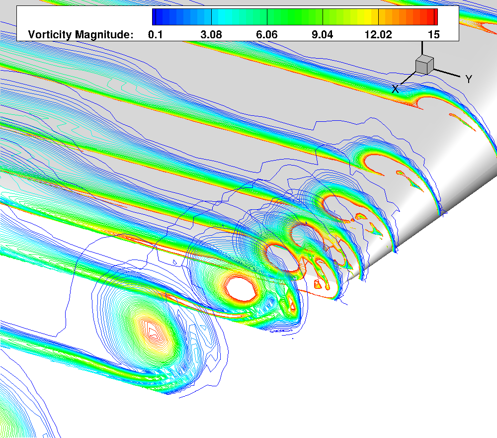

### AEROSPACE vs OCEANOGRAPHY MODELING

These notes are made from my experience of working in aerospace and oceanographic models.
The notes are highly generalized and present limited examples.

Brief description of the aerospace and ocean model:

##### a) Aerospace model:
The code that I worked for aerospace application in my PhD was called OVERTURNS.
It is being developed and maintained at University of Maryland. It has been widely used in rotorcraft
applications. Another example of a popular choice for rotorcraft simulations is NASA's OVERFLOW.
##### b) Ocean model:
The code that I currently develop and use is called COAWST. COAWST itself is a coupled model that consists of an ocean model
ROMS, wave model SWAN and atmosphere model WRF. It is being developed and maintained at US Geological Survey's Woods Hole Marine Center. Within the ocean model, it has a sediment transport model, vegetation model and biogeochemistry models.

Now we will proceed with the differences in the model equations and setup methods. 

#### 1. CFD Assumptions in the models

##### a) Aerospace:

1.1) Usually the aerospace applications can have either a compressible or incompressible solver.
Any application with Mach number > 0.3 employs a compressible solver (change in density is significant).
You end up solving one more equation for density variation and additional
terms in NS equations for momentum and energy.

1.2) Boussinesq approximation in aerospace implies

##### b) Ocean:

1.1) The ocean model ROMS is a hydrostatic model. It cannot resolve the fine structures.

1.2)

