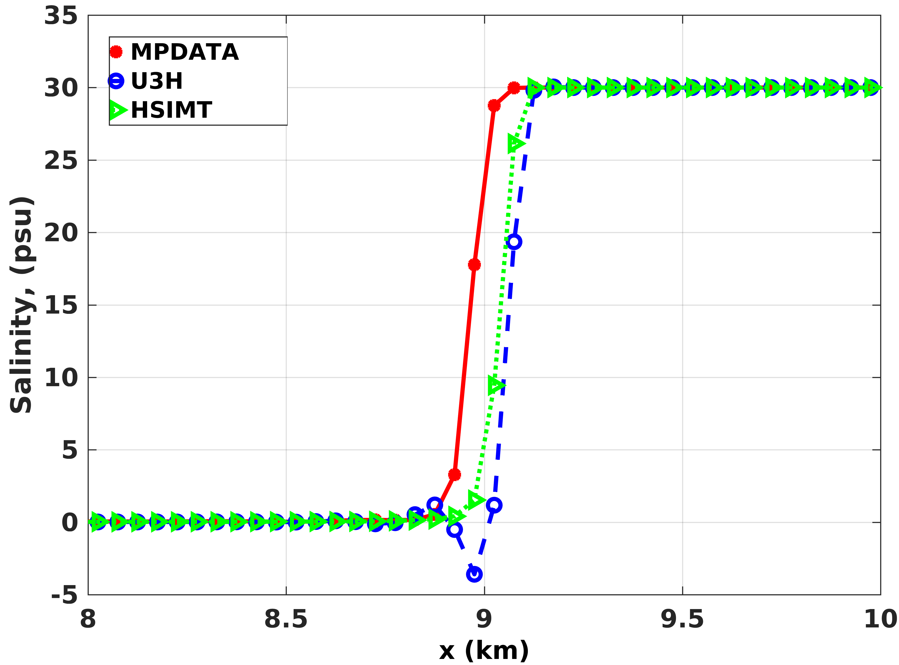

Some notes on Lax Wendroff methods such as MPDATA commonly used in geophysical modeling. 

For more on a paper that goes over the effect of tracer advection schemes including the explanation of the figure above: 
https://www.mdpi.com/2077-1312/7/10/338

